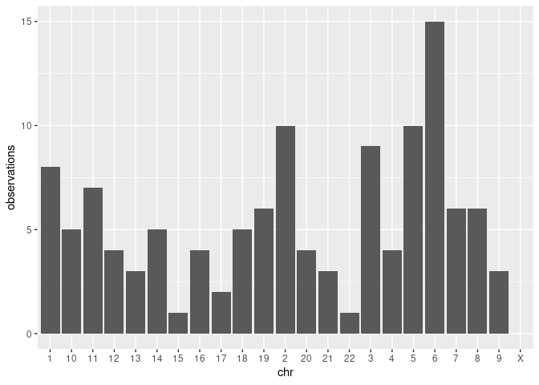
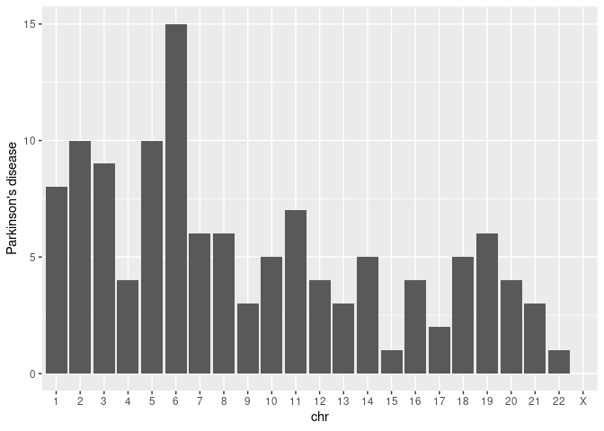
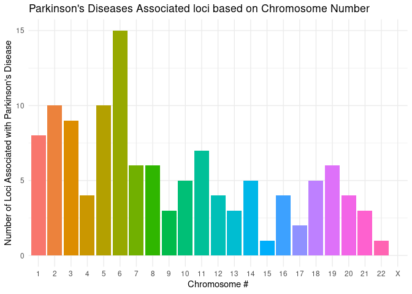
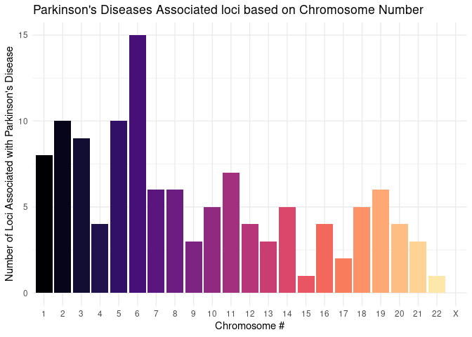

Module I
================

### Downloading Sample Data

For the purpose of only trying the `tidyverse` R package, sample data of
**PheWAS of GWAS Catalog of SNPs** was downloaded from **eMERGE**
databases. The downloaded data can be found here:

<https://phewascatalog.org/files/phewas-catalog.csv.zip>.

The downloaded file was unzipped to get the CSV file.

Why did I choose this dataset?

Because I want to see if we can drive meaningful claims out of simple
analysis of SNP/phenotype association data for common photypes/diseases,
*i.e.* Parkinson’s disease.

Main steps:

1.  import the librarie(s)
2.  load the data
3.  View the data and study the structure of the columns.
4.  Modify whatever needs to be modified for better analysis.
5.  Group the observations based on chromosome number, phenotype, and/or
    SNP ID.
6.  Take a closer look at Parkinson’s disease.
7.  Plot some meaningful figure(s) for the take-home-msg.

### Importing the `tidyverse` Library

``` r
library(tidyverse)
```

    ## ── Attaching packages ─────────────────────────────────────── tidyverse 1.3.1 ──

    ## ✓ ggplot2 3.3.5     ✓ purrr   0.3.4
    ## ✓ tibble  3.1.6     ✓ dplyr   1.0.7
    ## ✓ tidyr   1.1.4     ✓ stringr 1.4.0
    ## ✓ readr   2.1.1     ✓ forcats 0.5.1

    ## ── Conflicts ────────────────────────────────────────── tidyverse_conflicts() ──
    ## x dplyr::filter() masks stats::filter()
    ## x dplyr::lag()    masks stats::lag()

``` r
library(viridis)
```

    ## Loading required package: viridisLite

### Load the Data

``` r
df <- read.csv("phewas-catalog.csv")
head(df)
```

    ##    chromosome        snp                         phewas.phenotype cases
    ## 1 19 45395619  rs2075650                      Alzheimer's disease   737
    ## 2 19 45395619  rs2075650                                Dementias  1170
    ## 3    6 396321 rs12203592                        Actinic keratosis  2505
    ## 4  6 26093141  rs1800562                 Iron metabolism disorder    40
    ## 5 19 45395619  rs2075650 Delirium dementia and amnestic disorders  1566
    ## 6 1 196702810  rs1329428         Age-related macular degeneration   749
    ##     p.value odds.ratio gene_name phewas.code
    ## 1 5.237e-28      2.410    TOMM40      290.11
    ## 2 2.409e-26      2.114    TOMM40      290.10
    ## 3 4.141e-26      1.691      IRF4      702.10
    ## 4 3.409e-25     12.270       HFE      275.10
    ## 5 8.027e-24      1.841    TOMM40      290.00
    ## 6 7.157e-20      0.514       CFH      362.29
    ##                                                                                                                                                                                                                             gwas.associations
    ## 1                                                                                 Alzheimer's disease, Alzheimer's disease biomarkers, Amyloid Beta Peptide 1-42, LDL Cholesterol, C-reactive protein, Total Cholesterol, Grey matter density
    ## 2                                                                                 Alzheimer's disease, Alzheimer's disease biomarkers, Amyloid Beta Peptide 1-42, LDL Cholesterol, C-reactive protein, Total Cholesterol, Grey matter density
    ## 3                                                                                                                                                                            Eye color, Hair color, Freckling, Progressive supranuclear palsy
    ## 4 Mean corpuscular hemoglobin, Glycated hemoglobin, LDL Cholesterol, Transferrin saturation, Serum iron, Hematocrit, Total Transferrin, Mean corpuscular volume, Total Cholesterol, Serum transferrin, Ferritin concentration, Serum ferritin
    ## 5                                                                                 Alzheimer's disease, Alzheimer's disease biomarkers, Amyloid Beta Peptide 1-42, LDL Cholesterol, C-reactive protein, Total Cholesterol, Grey matter density
    ## 6                                                                                                                                                                                                            Age-related macular degeneration

### Data Analysis

(involve split-apply-combine approach)

``` r
str(df)
```

    ## 'data.frame':    215107 obs. of  9 variables:
    ##  $ chromosome       : Factor w/ 2185 levels "1","1 100049785",..: 954 954 1809 1732 954 86 1809 1729 1809 1088 ...
    ##  $ snp              : Factor w/ 3144 levels "rs1000579","rs1000778",..: 1182 1182 507 1039 1182 691 507 982 507 2393 ...
    ##  $ phewas.phenotype : Factor w/ 1354 levels "Abdominal aortic aneurysm",..: 99 386 49 711 383 83 840 711 1201 630 ...
    ##  $ cases            : int  737 1170 2505 40 1566 749 1931 40 2161 46 ...
    ##  $ p.value          : num  5.24e-28 2.41e-26 4.14e-26 3.41e-25 8.03e-24 ...
    ##  $ odds.ratio       : num  2.41 2.11 1.69 12.27 1.84 ...
    ##  $ gene_name        : Factor w/ 1776 levels "AAK1","ABCA1",..: 1624 1624 787 685 1624 320 787 1437 787 1674 ...
    ##  $ phewas.code      : num  290 290 702 275 290 ...
    ##  $ gwas.associations: Factor w/ 754 levels "3-(4-hydroxyphenyl)lactate / Isovalerylcarnitine",..: 40 40 257 425 40 13 257 424 257 599 ...

Splitting the chromosome column to chromosome and position columns for
better grouping of the SNPs.

``` r
df2 <- df %>% separate(chromosome, c("chr", "pos"))
head(df2)
```

    ##   chr       pos        snp                         phewas.phenotype cases
    ## 1  19  45395619  rs2075650                      Alzheimer's disease   737
    ## 2  19  45395619  rs2075650                                Dementias  1170
    ## 3   6    396321 rs12203592                        Actinic keratosis  2505
    ## 4   6  26093141  rs1800562                 Iron metabolism disorder    40
    ## 5  19  45395619  rs2075650 Delirium dementia and amnestic disorders  1566
    ## 6   1 196702810  rs1329428         Age-related macular degeneration   749
    ##     p.value odds.ratio gene_name phewas.code
    ## 1 5.237e-28      2.410    TOMM40      290.11
    ## 2 2.409e-26      2.114    TOMM40      290.10
    ## 3 4.141e-26      1.691      IRF4      702.10
    ## 4 3.409e-25     12.270       HFE      275.10
    ## 5 8.027e-24      1.841    TOMM40      290.00
    ## 6 7.157e-20      0.514       CFH      362.29
    ##                                                                                                                                                                                                                             gwas.associations
    ## 1                                                                                 Alzheimer's disease, Alzheimer's disease biomarkers, Amyloid Beta Peptide 1-42, LDL Cholesterol, C-reactive protein, Total Cholesterol, Grey matter density
    ## 2                                                                                 Alzheimer's disease, Alzheimer's disease biomarkers, Amyloid Beta Peptide 1-42, LDL Cholesterol, C-reactive protein, Total Cholesterol, Grey matter density
    ## 3                                                                                                                                                                            Eye color, Hair color, Freckling, Progressive supranuclear palsy
    ## 4 Mean corpuscular hemoglobin, Glycated hemoglobin, LDL Cholesterol, Transferrin saturation, Serum iron, Hematocrit, Total Transferrin, Mean corpuscular volume, Total Cholesterol, Serum transferrin, Ferritin concentration, Serum ferritin
    ## 5                                                                                 Alzheimer's disease, Alzheimer's disease biomarkers, Amyloid Beta Peptide 1-42, LDL Cholesterol, C-reactive protein, Total Cholesterol, Grey matter density
    ## 6                                                                                                                                                                                                            Age-related macular degeneration

``` r
str(df2)
```

    ## 'data.frame':    215107 obs. of  10 variables:
    ##  $ chr              : chr  "19" "19" "6" "6" ...
    ##  $ pos              : chr  "45395619" "45395619" "396321" "26093141" ...
    ##  $ snp              : Factor w/ 3144 levels "rs1000579","rs1000778",..: 1182 1182 507 1039 1182 691 507 982 507 2393 ...
    ##  $ phewas.phenotype : Factor w/ 1354 levels "Abdominal aortic aneurysm",..: 99 386 49 711 383 83 840 711 1201 630 ...
    ##  $ cases            : int  737 1170 2505 40 1566 749 1931 40 2161 46 ...
    ##  $ p.value          : num  5.24e-28 2.41e-26 4.14e-26 3.41e-25 8.03e-24 ...
    ##  $ odds.ratio       : num  2.41 2.11 1.69 12.27 1.84 ...
    ##  $ gene_name        : Factor w/ 1776 levels "AAK1","ABCA1",..: 1624 1624 787 685 1624 320 787 1437 787 1674 ...
    ##  $ phewas.code      : num  290 290 702 275 290 ...
    ##  $ gwas.associations: Factor w/ 754 levels "3-(4-hydroxyphenyl)lactate / Isovalerylcarnitine",..: 40 40 257 425 40 13 257 424 257 599 ...

Let’s adjust the data types of the columns

``` r
df2$chr <- as.factor(df2$chr)
df2$pos <- as.numeric(df2$pos)
df2$phewas.code <- as.character(df2$phewas.code)
# df2$gwas.associations <- as.character(df2$gwas.associations)
str(df2)
```

    ## 'data.frame':    215107 obs. of  10 variables:
    ##  $ chr              : Factor w/ 23 levels "1","10","11",..: 11 11 19 19 11 1 19 19 19 12 ...
    ##  $ pos              : num  45395619 45395619 396321 26093141 45395619 ...
    ##  $ snp              : Factor w/ 3144 levels "rs1000579","rs1000778",..: 1182 1182 507 1039 1182 691 507 982 507 2393 ...
    ##  $ phewas.phenotype : Factor w/ 1354 levels "Abdominal aortic aneurysm",..: 99 386 49 711 383 83 840 711 1201 630 ...
    ##  $ cases            : int  737 1170 2505 40 1566 749 1931 40 2161 46 ...
    ##  $ p.value          : num  5.24e-28 2.41e-26 4.14e-26 3.41e-25 8.03e-24 ...
    ##  $ odds.ratio       : num  2.41 2.11 1.69 12.27 1.84 ...
    ##  $ gene_name        : Factor w/ 1776 levels "AAK1","ABCA1",..: 1624 1624 787 685 1624 320 787 1437 787 1674 ...
    ##  $ phewas.code      : chr  "290.11" "290.1" "702.1" "275.1" ...
    ##  $ gwas.associations: Factor w/ 754 levels "3-(4-hydroxyphenyl)lactate / Isovalerylcarnitine",..: 40 40 257 425 40 13 257 424 257 599 ...

Let’s group by chromosome and count the number of occurrences of each
phenotype/disease.

``` r
# group_by(df2, chr)
chr.phe <- df2 %>% 
  group_by(chr) %>%
  count(phewas.phenotype)
head(chr.phe)
```

    ## # A tibble: 6 × 3
    ## # Groups:   chr [1]
    ##   chr   phewas.phenotype                                                       n
    ##   <fct> <fct>                                                              <int>
    ## 1 1     Abdominal aortic aneurysm                                             19
    ## 2 1     Abdominal hernia                                                      17
    ## 3 1     Abdominal pain                                                         9
    ## 4 1     Abnormal chest sounds                                                 10
    ## 5 1     Abnormal coagulation profile                                          19
    ## 6 1     Abnormal cytological, histological, immunological and DNA test fi…    10

Let’s do the opposite this time: group by phenotype/diseases and count
the number of occurrences of each chromosome.

``` r
# group_by(df2, chr)
phe.chr <- df2 %>% 
  group_by(phewas.phenotype) %>%
  count(chr)
head(phe.chr)
```

    ## # A tibble: 6 × 3
    ## # Groups:   phewas.phenotype [1]
    ##   phewas.phenotype          chr       n
    ##   <fct>                     <fct> <int>
    ## 1 Abdominal aortic aneurysm 1        19
    ## 2 Abdominal aortic aneurysm 10        6
    ## 3 Abdominal aortic aneurysm 11       11
    ## 4 Abdominal aortic aneurysm 12       13
    ## 5 Abdominal aortic aneurysm 13        5
    ## 6 Abdominal aortic aneurysm 14        4

How is that differemt from grouping by both the chromosome number and
the phenotype/disease and counting the SNPs? Should the SNPs be unique
(all the counts = 1)?

``` r
# group_by(df2, chr)
chr.phe.snp <- df2 %>% 
  group_by(chr, phewas.phenotype) %>%
  count(snp)
table(chr.phe.snp$n)
```

    ## 
    ##      1      2 
    ## 214633    237

It’s seems that 237 are duplicated per chromosome per phenotype. Why is
that?

**split-apply-combine**

``` r
sac.1 <-df2 %>% 
  group_by(chr, phewas.phenotype) %>% 
  count(snp) %>% 
  spread(phewas.phenotype, n)
head(sac.1)
```

    ## # A tibble: 6 × 1,356
    ## # Groups:   chr [1]
    ##   chr   snp        `Abdominal aortic aneurysm` `Abdominal her…` `Abdominal pain`
    ##   <fct> <fct>                            <int>            <int>            <int>
    ## 1 1     rs1009080                           NA               NA               NA
    ## 2 1     rs1011731                           NA               NA               NA
    ## 3 1     rs1043879                           NA               NA               NA
    ## 4 1     rs10489202                          NA               NA               NA
    ## 5 1     rs10489849                          NA               NA               NA
    ## 6 1     rs10493389                          NA               NA               NA
    ## # … with 1,351 more variables: `Abnormal chest sounds` <int>,
    ## #   `Abnormal coagulation profile` <int>,
    ## #   `Abnormal cytological, histological, immunological and DNA test findings` <int>,
    ## #   `Abnormal electrocardiogram` <int>,
    ## #   `Abnormal findings examination of lungs` <int>,
    ## #   `Abnormal findings on exam of gastrointestinal tract/abdominal area` <int>,
    ## #   `Abnormal findings on examination of urine` <int>, …

That yielded a sparse matrix. Let’s try something different.

``` r
sac.2 <-df2 %>% 
  group_by(phewas.phenotype) %>% 
  count(chr) %>% 
  spread(phewas.phenotype, n) %>% 
  replace(is.na(.), 0)
head(sac.2)
```

    ## # A tibble: 6 × 1,355
    ##   chr   `Abdominal aortic a…` `Abdominal her…` `Abdominal pain` `Abnormal ches…`
    ##   <fct>                 <int>            <int>            <int>            <int>
    ## 1 1                        19               17                9               10
    ## 2 10                        6                7                9                6
    ## 3 11                       11               10                9                2
    ## 4 12                       13                7               13                6
    ## 5 13                        5                2                5               11
    ## 6 14                        4                7                7                3
    ## # … with 1,350 more variables: `Abnormal coagulation profile` <int>,
    ## #   `Abnormal cytological, histological, immunological and DNA test findings` <int>,
    ## #   `Abnormal electrocardiogram` <int>,
    ## #   `Abnormal findings examination of lungs` <int>,
    ## #   `Abnormal findings on exam of gastrointestinal tract/abdominal area` <int>,
    ## #   `Abnormal findings on examination of urine` <int>,
    ## #   `Abnormal findings on mammogram or breast exam` <int>, …

This is a very useful one! The output is a matrix where we now the
number of SNPs (better said as observations because IDK the reason
behind the duplicates detected earlier yet) per chromosome per
phenotype.

Let’s take a closer look at Parkinson’s Disease

``` r
parkinson <- sac.2 %>% select("chr", "Parkinson's disease")
parkinson
```

    ## # A tibble: 23 × 2
    ##    chr   `Parkinson's disease`
    ##    <fct>                 <int>
    ##  1 1                         8
    ##  2 10                        5
    ##  3 11                        7
    ##  4 12                        4
    ##  5 13                        3
    ##  6 14                        5
    ##  7 15                        1
    ##  8 16                        4
    ##  9 17                        2
    ## 10 18                        5
    ## # … with 13 more rows

### Including Some Plots

(include a plot or two made with ggplot2)

<!-- -->

Let’s re-aarnge the bars.

``` r
as.data.frame(parkinson) %>%
  mutate(chr = fct_relevel(chr, 
                           "1", "2", "3", "4", "5", "6", "7",
                           "8", "9", "10", "11", "12", "13",
                           "14", "15", "16", "17", "18", "19",
                           "20", "21", "22", "X")) %>%
  ggplot( aes(x=chr, y=`Parkinson's disease`)) +
  geom_bar(stat="identity")
```

<!-- -->

We can claim that chromosome 6 has a lot of regions that are related to
Parkinson’s disease. A better study of the phenotype should consider the
number of cases per each location not only the number of locations.

Visually appealing figures:

``` r
as.data.frame(parkinson) %>%
  mutate(chr = fct_relevel(chr, 
                           "1", "2", "3", "4", "5", "6", "7",
                           "8", "9", "10", "11", "12", "13",
                           "14", "15", "16", "17", "18", "19",
                           "20", "21", "22", "X")) %>%
  ggplot( aes(x=chr, y=`Parkinson's disease`, fill=chr)) +
  geom_bar(stat="identity") +
  theme_minimal() + theme(legend.position="none") +
  # scale_fill_discrete() + 
  xlab("Chromosome #") +
  ylab("Number of Loci Associated with Parkinson's Disease") + 
  labs(title = "Parkinson's Diseases Associated loci based on Chromosome Number") 
```

<!-- -->

``` r
as.data.frame(parkinson) %>%
  mutate(chr = fct_relevel(chr, 
                           "1", "2", "3", "4", "5", "6", "7",
                           "8", "9", "10", "11", "12", "13",
                           "14", "15", "16", "17", "18", "19",
                           "20", "21", "22", "X")) %>%
  ggplot( aes(x=chr, y=`Parkinson's disease`, fill=chr)) +
  geom_bar(stat="identity") +
  theme_minimal() + theme(legend.position="none") +
  # scale_fill_discrete() + 
  scale_fill_viridis(discrete=TRUE, option="magma") +
  xlab("Chromosome #") +
  ylab("Number of Loci Associated with Parkinson's Disease") + 
  labs(title = "Parkinson's Diseases Associated loci based on Chromosome Number") 
```

<!-- -->
